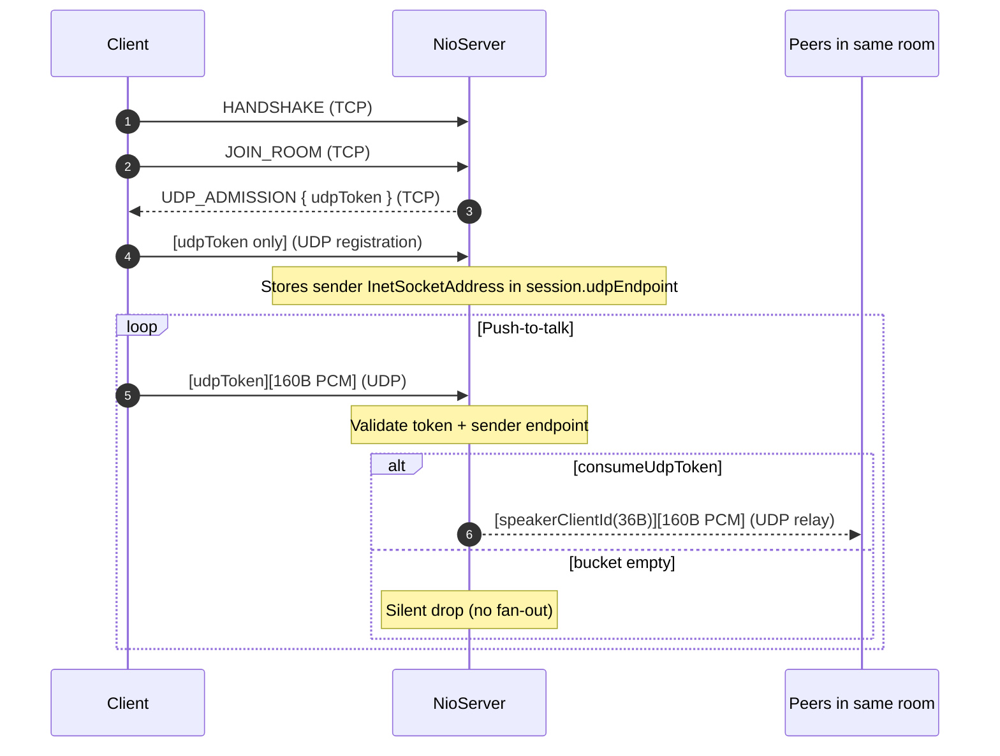
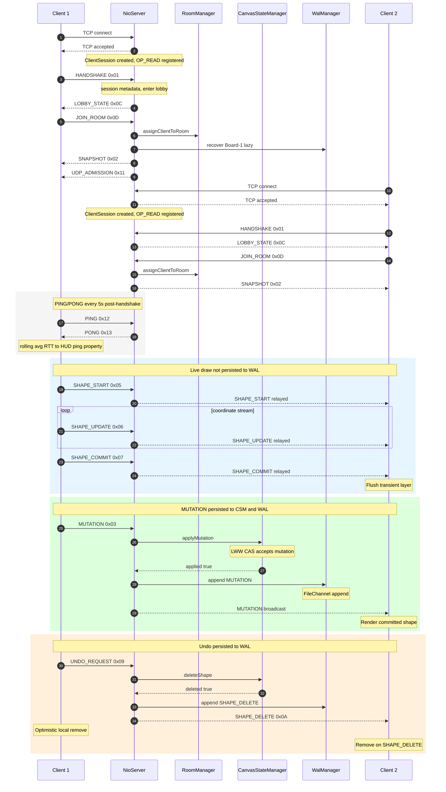

# DistriSync — Architecture Reference

> **Audience:** Engineers joining the project or conducting a design review.  
> **Scope:** All packages under `com.distrisync`.  
> Generated by static analysis of the production source tree.

---

## Table of Contents

1. [Custom Binary Protocol](#1-custom-binary-protocol)
2. [OSI Model Mapping](#2-osi-model-mapping)
3. [Concurrency Model — NIO Selector Event Loop](#3-concurrency-model--nio-selector-event-loop)
4. [State Management — CanvasStateManager](#4-state-management--canvasstatemanager)
5. [Session Multiplexing — Rooms & Boards](#5-session-multiplexing--rooms--boards)
6. [Write-Ahead Log — WalManager](#6-write-ahead-log--walmanager)
7. [Pointer State Management — PointerStateManager](#7-pointer-state-management--pointerstate--pointerstate-manager)
8. [Dual-Protocol VoIP Audio Engine](#8-dual-protocol-voip-audio-engine)
9. [Telemetry & Observability](#9-telemetry--observability)
10. [Storage Lifecycle — Idle Room GC](#10-storage-lifecycle--idle-room-gc)
11. [Extended Shape Model & Drawing Pipeline](#11-extended-shape-model--drawing-pipeline)
12. [Object Eraser & Spatial Hit-Testing](#12-object-eraser--spatial-hit-testing)
13. [Participant Roster & Voice State](#13-participant-roster--voice-state)
14. [Canvas Viewport & Global Drawing Context](#14-canvas-viewport--global-drawing-context)
15. [Redis Backplane — Horizontal Scaling](#15-redis-backplane--horizontal-scaling)
16. [Remote Mailbox & Distributed Authority](#16-remote-mailbox--distributed-authority)
17. [TCP Multiplayer Cursors (`CURSOR_SYNC`)](#17-tcp-multiplayer-cursors-cursor_sync)
18. [Per-Session Write Backpressure](#18-per-session-write-backpressure)
19. [Load & Chaos Tooling](#19-load--chaos-tooling)
20. [Room RBAC — RoomPermissions](#20-room-rbac--roompermissions)
21. [Host Election & ROLE_UPDATE](#21-host-election--role_update)
22. [Moderation & SESSION_REVOKED](#22-moderation--session_revoked)
23. [Collaboration Roster & Board Presence](#23-collaboration-roster--board-presence)
24. [Workspace Board Deletion](#24-workspace-board-deletion)
25. [Room Watch Party & Media Sync](#25-room-watch-party--media-sync)
26. [Sequence Diagram — Two-Client Collaboration Flow](#26-sequence-diagram--two-client-collaboration-flow)

---

## 1. Custom Binary Protocol

### 1.1 Frame Layout

Every DistriSync message, regardless of direction or type, is wrapped in the same 5-byte fixed header followed by a variable-length UTF-8 JSON payload. The codec class `MessageCodec` (constant `HEADER_BYTES = 5`) enforces this invariant on both encode and decode paths.

```
 ┌───────────────┬───────────────────────────────┬───────────────────────────────────────┐
 │   Byte 0      │   Bytes 1 – 4                 │   Bytes 5 … (5 + PayloadLength − 1)   │
 │  MessageType  │  PayloadLength (int32 BE)      │  UTF-8 JSON payload                   │
 │   (1 byte)    │  (4 bytes, big-endian signed)  │  (0 – 16,777,216 bytes)               │
 └───────────────┴───────────────────────────────┴───────────────────────────────────────┘
```

| Field           | Size     | Encoding                | Constraints                                  |
|-----------------|----------|-------------------------|----------------------------------------------|
| `MessageType`   | 1 byte   | Unsigned discriminator  | Must be a known wire code (see §1.2)         |
| `PayloadLength` | 4 bytes  | Signed int32, big-endian| `0 ≤ value ≤ 16 MiB`; negative → protocol error |
| `Payload`       | N bytes  | UTF-8 JSON              | Exact length declared by `PayloadLength`     |

**Total minimum frame size:** 5 bytes (header only, zero-length payload).  
**Maximum frame size:** 16,777,221 bytes (5 header + 16 MiB payload).

#### Partial-read contract

`MessageCodec.decode()` is **non-destructive on incomplete input**. If the buffer does not contain a complete frame, the buffer's `position` is rewound to its value on entry and a `PartialMessageException` is thrown. The `NioServer` event loop exploits this via the `readBuffer.compact()` idiom — unprocessed bytes are slid to the front of the buffer and new bytes are appended on the next `OP_READ` wake-up.

---

### 1.2 Message Type Registry

| Wire Code | Enum Name          | Direction            | Persisted to WAL | Description                                                                 |
|-----------|--------------------|----------------------|------------------|-----------------------------------------------------------------------------|
| `0x01`    | `HANDSHAKE`        | Client → Server      | No               | Initial greeting. Payload: `{ authorName, clientId }`. Populates `ClientSession` metadata. |
| `0x02`    | `SNAPSHOT`         | Server → Client      | No               | Chunked join header: empty JSON array `[]`, or legacy full board payload. Starts hydration; shapes follow as `MUTATION_BATCH` frames until `SNAPSHOT_END`. |
| `0x03`    | `MUTATION`         | Client ↔ Server      | **Yes**          | Committed shape add/update. Payload: single shape envelope with `_type` discriminator, `objectId` (UUID), `timestamp` (Lamport). |
| `0x04`    | `UDP_POINTER`      | Client → Server (UDP)| No               | Ephemeral cursor-position broadcast. Fire-and-forget; loss is acceptable.  |
| `0x05`    | `SHAPE_START`      | Client → All peers   | No               | Peer begins drawing; carries tool, color, and origin coordinates.           |
| `0x06`    | `SHAPE_UPDATE`     | Client → All peers   | No               | Incremental coordinate stream for an in-progress shape (live preview).      |
| `0x07`    | `SHAPE_COMMIT`     | Client → All peers   | No               | Drawing gesture completed; peers flush their transient preview canvas layer.|
| `0x08`    | `CLEAR_USER_SHAPES`| Client ↔ All peers   | **Yes**          | Remove all shapes owned by `clientId`. Payload: JSON string of `clientId`. Server broadcasts after purging `shapeMap`. |
| `0x09`    | `UNDO_REQUEST`     | Client → Server      | No               | Delete one shape by UUID. Payload: `{ "shapeId": "<uuid>" }`. Server responds with `SHAPE_DELETE`. |
| `0x0A`    | `SHAPE_DELETE`     | Server → All peers   | **Yes**          | Server confirms deletion. Payload: `{ "shapeId": "<uuid>" }`. Broadcast to all peers except originator. |
| `0x0B`    | `TEXT_UPDATE`      | Client → All peers   | No               | Ephemeral live-typing event. Payload: `{ objectId, clientId, authorName, x, y, currentText }`. Never written to `shapeMap`; final committed `TextNode` arrives as a `MUTATION`. |
| `0x0C`    | `LOBBY_STATE`      | Server → Client      | No               | Room discovery snapshot. Payload: JSON array of `{ roomId, userCount }`, merged from active rooms plus persisted WAL stems. |
| `0x0D`    | `JOIN_ROOM`        | Client ↔ Server      | No               | **Client→server:** `{ roomId, initialBoardId? }`. **Server→peers:** `{ clientId, authorName }` when a member joins. |
| `0x0E`    | `LEAVE_ROOM`       | Client ↔ Server      | No               | **Client→server:** empty (return to lobby). **Server→peers:** JSON string `clientId` on depart / kick / disconnect. |
| `0x0F`    | `SWITCH_BOARD`     | Client → Server      | No               | Switches the active board within the current room workspace. Payload: JSON string board id (e.g. `"Board-1"`). |
| `0x10`    | `BOARD_LIST_UPDATE`| Server → Client      | No               | Announces room board-index changes for multi-board workspaces. Payload is a JSON array of board id strings. |
| `0x11`    | `UDP_ADMISSION`    | Server → Client      | No               | Grants access to the UDP audio data plane; payload contains `{ udpToken }`. |
| `0x12`    | `PING`             | Client → Server      | No               | Heartbeat RTT probe. Payload: `{ "t": <originMillis> }`; accepted only post-handshake. |
| `0x13`    | `PONG`             | Server → Client      | No               | Echo of `PING` origin timestamp. Payload: `{ "t": <originMillis> }`; client computes RTT as `now - t`. |
| `0x14`    | `DELETE_ROOM`      | Client → Server      | No               | Durable room teardown request. Payload: `{ roomId }`; allowed from lobby or from the same active room only. |
| `0x15`    | `ROOM_DELETED`     | Server → Client      | No               | Forced room-eviction event. Empty payload; clients clear room/board state and return to lobby UI. |
| `0x16`    | `FETCH_LOBBY`      | Client → Server      | No               | Pull-based lobby refresh request. Payload must be exactly `{}` (ignoring surrounding whitespace). |
| `0x17`    | `VOICE_STATE`      | Client ↔ Server      | No               | Hardware mute toggle. Payload: `{ clientId, isMuted }`. Server validates `clientId` against session, then relays to all peers in the room via room-wide broadcast (not board-scoped). |
| `0x18`    | `STATE_REQUEST`    | Backplane only       | No               | Cold node requests room hydration. Payload: `{}`. Published on `distrisync:room:{roomId}` when a room is first materialized locally. |
| `0x19`    | `STATE_SNAPSHOT`   | Backplane only       | No               | Hot node bulk board payload (same JSON array shape as `SNAPSHOT`). Answers `STATE_REQUEST`; never accepted from TCP clients. |
| `0x1A`    | `CURSOR_SYNC`      | Client ↔ Server      | No               | Ephemeral multiplayer cursor. Payload: `{ clientId, authorName, x, y }`. Relayed in-room on TCP; cross-node via Redis `:presence` channel (no WAL / dedup). |
| `0x1B`    | `MODERATION_ACTION`| Client → Server / Backplane | No | `{ actionType, targetClientId, reason }`. Supported `actionType`: `KICK`, `REVOKE_SPEAK`, `GRANT_SPEAK`. Requires `PERM_MANAGE_USERS`. |
| `0x1C`    | `SESSION_REVOKED`  | Server → Client      | No               | `{ reason }`. Sent to a kicked client; triggers lobby return and UI toast. |
| `0x1D`    | `ROLE_UPDATE`      | Server → Client      | No               | `{ newHostClientId, newPermissions, roomHostClientId? }`. Syncs affected client permissions and room host id. |
| `0x1E`    | `BOARD_SWITCH`     | Server → Room        | No               | `{ clientId, newBoardId }`. Room-wide active-board presence for roster grouping. |
| `0x1F`    | `TOGGLE_BOARD_LOCK`| Client ↔ Server      | No               | `{ locked }`. Host sets `RoomContext.boardCreationLocked`; server broadcasts state to all room members. |
| `0x20`    | `DELETE_BOARD`     | Client → Server      | No               | JSON string `boardId`. Requires `PERM_MANAGE_ROOM`. Cannot delete `Board-1` (default). Tombstones board + deletes WAL. |
| `0x21`    | `BOARD_DELETED`    | Server → Room        | No               | JSON string `boardId`. Notifies all occupants to refresh board list / Task View UI. |
| `0x22`    | `MEDIA_STATE_UPDATE` | Server → Room      | No               | `{ state, mediaTimeSeconds, serverEpochMs, videoId }` — authoritative room-global media snapshot. When `state` is `PLAYING`, position at client time `t` is `mediaTimeSeconds + (t - serverEpochMs) / 1000.0`; when `PAUSED`, use `mediaTimeSeconds` directly. Hydrated on join and via control channel on multi-node clusters. |
| `0x23`    | `MEDIA_CONTROL`    | Client → Server      | No               | `{ action, requestedTime, targetId }` — `action`: `PLAY`, `PAUSE`, `SEEK`, `LOAD`, `STOP`. Requires `PERM_MANAGE_MEDIA`. Server derives `MEDIA_STATE_UPDATE`, stores `RoomContext.currentMediaState` (`null` after `STOP`), broadcasts locally, and publishes to Redis control channel. |
| `0x24`    | `MUTATION_BATCH`     | Client ↔ Server      | **Yes**          | Batched committed shapes (freehand stroke segments). Payload: JSON array of shape envelopes (same format as `SNAPSHOT`). Server applies each shape via LWW `applyMutation`, then one WAL append and one board broadcast per frame. On join, server streams board state as chunked `MUTATION_BATCH` frames between `SNAPSHOT` `[]` and `SNAPSHOT_END`. |
| `0x25`    | `SNAPSHOT_END`       | Server → Client      | No               | Marks end of chunked snapshot hydration. Empty payload; client applies buffered shapes from preceding batches. |

#### Shape Envelope Format (MUTATION / SNAPSHOT)

```json
{
  "_type":      "Circle",
  "objectId":   "550e8400-e29b-41d4-a716-446655440000",
  "clientId":   "user-42",
  "authorName": "Alice",
  "timestamp":  1712080800000,
  "color":      "#FF5733",
  "x":          120.0,
  "y":          240.0,
  "radius":     35.0,
  "filled":     false,
  "strokeWidth": 2.0
}
```

Supported `_type` discriminators: `Line`, `Circle`, `RectangleNode`, `EllipseNode`, `ArrowNode`, `TextNode`, `EraserPath` (legacy; object eraser deletes shapes via `UNDO_REQUEST` / `SHAPE_DELETE` instead of appending `EraserPath` mutations).

---

## 2. OSI Model Mapping

DistriSync operates across two layers of the OSI model. The lower layers (Physical through Network) are handled entirely by the OS kernel and are invisible to application code.

```
┌─────────────────────────────────────────────────────────────────┐
│  Layer 7 — Application Layer                                    │
│                                                                 │
│  DistriSync Application Protocol                                │
│  • MessageCodec      — frame encode/decode (5-byte header + JSON) │
│  • MessageType       — semantic dispatch (HANDSHAKE … TEXT_UPDATE) │
│  • ShapeCodec        — polymorphic shape serialization (_type tag) │
│  • CanvasStateManager — authoritative board state (LWW-CAS)     │
│  • RoomManager       — room routing registry                    │
│  • RoomContext       — per-room state container + key set       │
│  • WalManager        — durable append log for crash recovery    │
│  • NioServer         — connection lifecycle, broadcast, teardown │
├─────────────────────────────────────────────────────────────────┤
│  Layer 4 — Transport Layer                                      │
│                                                                 │
│  TCP  (java.nio.channels.SocketChannel / ServerSocketChannel)   │
│  • Reliable, ordered, byte-stream delivery                      │
│  • TCP_NODELAY enabled — small frames sent without Nagle delay  │
│  • SO_SNDBUF / SO_RCVBUF set to 64 KiB to absorb burst traffic  │
│                                                                 │
│  UDP  (pointer + push-to-talk audio relay)                      │
│  • Unreliable, unordered datagram delivery                      │
│  • Wire code 0x04 (UDP_POINTER) — loss is intentionally OK      │
│  • Push-to-talk relay uses 10 ms micro-frames and               │
│    zero-allocation routing in the server hot path               │
├─────────────────────────────────────────────────────────────────┤
│  Layers 1–3  (Physical / Data Link / Network)                   │
│  OS kernel + hardware — transparent to application code         │
└─────────────────────────────────────────────────────────────────┘
```

### Why a custom binary framing protocol over TCP?

TCP is a **byte-stream** transport. It has no concept of message boundaries — a single `channel.read()` call may return a fraction of a frame, exactly one frame, or multiple frames concatenated. DistriSync's 5-byte length-prefix framing solves this: the receiver reads the `PayloadLength` field first and buffers until exactly that many bytes arrive. This is the standard approach used by protocols such as HTTP/2, gRPC, and Redis RESP3.

---

## 3. Concurrency Model — NIO Selector Event Loop

### 3.1 The Selector Pattern

`NioServer` runs a **single-threaded, non-blocking I/O event loop** powered by `java.nio.channels.Selector`. The entire server lifecycle — accept, read, decode, process, broadcast, write — executes on one thread.

```
                 ┌─────────────────────────────┐
                 │         NioServer thread     │
                 │                             │
  ┌──────────┐   │  selector.select() ◄──────────────────────┐
  │ OS kernel│   │        │                   │              │
  │ TCP stack│──►│  selectedKeys()             │              │
  └──────────┘   │        │                   │              │
                 │  ┌─────▼────────────────┐  │              │
                 │  │  dispatch(key)        │  │              │
                 │  │  ├─ handleAccept()    │  │              │
                 │  │  ├─ handleRead()      │──┤ partial frame│
                 │  │  │    decode loop     │  │ → compact()  │
                 │  │  │    processMessage()│  │              │
                 │  │  │    WAL append      │  │              │
                 │  │  │    broadcastRoom() │  │              │
                 │  │  └─ handleWrite()     │  │              │
                 │  └──────────────────────┘  │              │
                 │         │                  │              │
                 │  selected.clear() ──────────┘              │
                 │         └─────────────────────────────────►┘
                 └─────────────────────────────┘
```

**Key NIO primitives used:**

| Primitive              | Role in DistriSync                                                         |
|------------------------|----------------------------------------------------------------------------|
| `Selector`             | Multiplexes I/O readiness events for all client channels on one thread     |
| `SelectionKey.OP_ACCEPT` | Fires when the `ServerSocketChannel` has a pending connection to accept  |
| `SelectionKey.OP_READ` | Fires when a client channel has bytes available to read                    |
| `SelectionKey.OP_WRITE`| Armed *only* when a previous write stalled (TCP send-buffer full); cleared when the queue drains |
| `ClientSession.readBuffer` | 64 KiB per-connection accumulation buffer; uses `flip() / compact()` idiom for safe partial-frame handling |
| `ClientSession.writeQueue` | `ArrayDeque<ByteBuffer>` FIFO; each entry is an independent copy so one buffer can be enqueued for N recipients |

### 3.2 Why This Prevents Thread Starvation vs. 1:1 Thread-per-Client

| Property                  | 1:1 Thread-per-Client                                     | NIO Selector Event Loop (DistriSync)                      |
|---------------------------|-----------------------------------------------------------|-----------------------------------------------------------|
| **Thread count**          | 1 OS thread per connected client                          | 1 OS thread for all clients                               |
| **Blocking calls**        | Each thread blocks on `socket.read()`/`write()`           | No blocking calls; `selector.select()` returns only ready channels |
| **Memory**                | Each thread consumes ~512 KiB–2 MiB of stack space        | Fixed stack overhead regardless of client count           |
| **Context switching**     | O(N) scheduler overhead; CPU thrashes with many idle clients | O(ready) — only clients with actual I/O consume CPU time  |
| **Thread starvation risk**| High: a slow client occupies a thread, starving others for CPU | Eliminated: a slow client's `OP_WRITE` is simply re-armed; other channels still process |
| **Scalability**           | Degrades linearly; typically hits OS thread limits ~1K–10K clients | Scales to hundreds of thousands of open connections (C10K pattern) |

The critical invariant is that `NioServer` **never calls a blocking method inside the event loop**. All channel operations (`channel.read()`, `channel.write()`, `serverChannel.accept()`) are non-blocking because every channel is in non-blocking mode (`configureBlocking(false)`). If `channel.write()` can only partially drain (TCP send buffer full), `OP_WRITE` is armed via `key.interestOpsOr(SelectionKey.OP_WRITE)` and the loop continues serving other clients immediately.

---

## 4. State Management — CanvasStateManager

### 4.1 Data Structure

```
CanvasStateManager
└── shapeMap: ConcurrentHashMap<UUID, Shape>
      │
      ├── key:   Shape.objectId()  — random UUID, assigned by the originating client
      └── value: Shape (sealed hierarchy: Line | Circle | RectangleNode | EllipseNode | ArrowNode | TextNode | EraserPath)
                  ├── objectId():   UUID   — stable identity across the network
                  ├── clientId():   String — session-scoped owner (for CLEAR_USER_SHAPES)
                  ├── authorName(): String — human-readable attribution
                  └── timestamp():  long   — Lamport clock value; conflict-resolution key
```

### 4.2 UUID-Based Identity and Conflict Resolution

**Why UUIDs?**  
Each client generates a `UUID.randomUUID()` for every shape it creates *before* sending it to the server. This means:

1. **No round-trip required for identity** — the client can render its own shape optimistically before the server acknowledges it.
2. **Idempotency** — if a `MUTATION` frame is delivered twice (e.g. due to a network retry), the second application is a no-op because the stored `timestamp` will be `≥` the incoming one.
3. **Distributed undo** — any client holding the `objectId` of a shape it created can issue an `UNDO_REQUEST` with that UUID, and the server's `deleteShape(UUID)` operates in O(1) with no scan.

**Conflict resolution — last-writer-wins by Lamport timestamp:**

```java
// CanvasStateManager.applyMutation() — simplified
shapeMap.compute(incoming.objectId(), (id, existing) -> {
    if (existing == null || incoming.timestamp() > existing.timestamp()) {
        applied[0] = true;
        return incoming;   // newer wins
    }
    return existing;       // stale — reject silently
});
```

`ConcurrentHashMap.compute()` acquires an internal per-segment lock for the duration of the lambda, making this a **single atomic compare-and-swap** with no external synchronization required. The server only broadcasts a mutation to peers if `applied[0]` is `true`, preventing stale updates from polluting the network.

### 4.3 Undo Flow

```
Client                    Server (NioServer)         CanvasStateManager
  │                             │                          │
  │── UNDO_REQUEST ────────────►│                          │
  │   { shapeId: "uuid" }       │── deleteShape(uuid) ────►│
  │                             │                          │── shapeMap.remove(uuid)
  │                             │◄── true (deleted) ───────│
  │                             │                          │
  │                             │── SHAPE_DELETE ─────────►│ (broadcast to all room peers)
  │                             │   { shapeId: "uuid" }    │
```

`deleteShape()` is a single `ConcurrentHashMap.remove()` call — O(1) and safe from any thread. The server does **not** send a confirmation back to the requesting client; the client that issued `UNDO_REQUEST` removes the shape from its own canvas optimistically and only the *other* clients receive the `SHAPE_DELETE` broadcast.

### 4.4 Scoped Clear (CLEAR_USER_SHAPES)

```java
// CanvasStateManager.clearUserShapes() — per-segment locking via removeIf
shapeMap.values().removeIf(shape -> shape.clientId().equals(targetClientId));
```

This removes all shapes attributed to one `clientId` in a single pass using `ConcurrentHashMap`'s internal per-segment locks, making it consistent without a global lock. The server then rebroadcasts the same `CLEAR_USER_SHAPES` frame so every peer removes those shapes from its own local rendering canvas.

---

## 5. Session Multiplexing — Rooms & Boards

### 5.1 Overview

Prior to this layer, all connected clients shared a single global `CanvasStateManager`. The session-multiplexing architecture partitions the server into isolated rooms and then partitions each room into independent board contexts.

```
RoomManager
└── rooms: ConcurrentHashMap<String, RoomContext>
      │
      └── RoomContext (one per room)
            ├── roomId: String
            ├── hostClientId, isBoardCreationLocked
            ├── currentMediaState: MediaStatePayload?  ← room-global watch party (§25)
            ├── boards: ConcurrentHashMap<String, CanvasStateManager>
            │     └── key: boardId → isolated board state
            └── activeKeys: Set<SelectionKey>       ← ConcurrentHashMap-backed
                  │
                  └── one SelectionKey per connected client in this room
```

### 5.2 Room Lifecycle

| Phase | What happens |
|---|---|
| **First join** | `RoomManager.getOrCreateRoom(roomId)` calls `rooms.computeIfAbsent`, which atomically creates a `RoomContext`. Boards are lazily created with `boards.computeIfAbsent(boardId, ...)`, so unused boards incur zero allocation cost. |
| **Active** | Every `MUTATION`, `MUTATION_BATCH`, `SHAPE_DELETE`, and `CLEAR_USER_SHAPES` is applied only to the active board's `CanvasStateManager`, appended to that board's WAL partition, then broadcast to all `SelectionKey`s in `RoomContext.activeKeys` except the sender. |
| **Quiescent** | In the explicit `LEAVE_ROOM` path, `RoomManager.returnClientToLobby` removes the room when `activeKeys` reaches zero. In other paths (for example direct room deletion / lifecycle sweeps), empty rooms may exist transiently. |
| **Restart** | `RoomContext` is re-created on first join. Board state is recovered independently on demand through board-scoped WAL replay (`recover(roomId, boardId)`). |

### 5.3 Broadcast Scoping

`NioServer` previously called a global `broadcastExcept(senderKey, frame)`. With room/board multiplexing, broadcasts are scoped to `RoomContext.getActiveKeys()` and semantically constrained to the sender's active board:

```
for (SelectionKey key : room.getActiveKeys()) {
    if (key == senderKey) continue;
    ClientSession session = (ClientSession) key.attachment();
    session.enqueue(frame.duplicate());
    key.interestOpsOr(SelectionKey.OP_WRITE);
}
```

A client in Room A will never receive a frame from Room B, even if both rooms are served by the same `NioServer` instance on the same port. Within one room, mutations and broadcasts are strictly board-scoped, preventing cross-board thread contention and eliminating accidental inter-board state leakage.

### 5.4 WAL Integration in RoomManager

`RoomManager.appendToWal(roomId, boardId, message)` is a thin delegation wrapper:

- If no `WalManager` was provided at construction (ephemeral mode), the call is a no-op.
- `IOException` from the underlying `FileChannel` write is logged at `WARN` but not re-thrown — the mutation has already been applied in memory; dropping a single WAL record degrades durability without breaking the live session.
- The call is made **before** the broadcast so that the WAL record exists even if the subsequent write to one or more clients fails.

### 5.5 Lobby Merge + Durable Room Teardown

`RoomManager` now treats lobby discovery as a merged view of two sources:

1. **Active rooms in memory** (`rooms` map), with live `userCount`.
2. **Persisted room stems from WAL files** (`WalManager.getPersistedRoomIds()`), exposed with `userCount = 0` when no in-memory room currently exists.

The merge path (`mergePersistedWalStemsWithActiveRooms`) removes duplicates by comparing active room IDs after `WalManager.sanitize(...)`, then sorts rows by `roomId` before encoding `LOBBY_STATE`.

Room deletion is a first-class lifecycle event:

- Client sends `DELETE_ROOM { roomId }`.
- `NioServer` validates scope (from lobby, or from the same active room only) and calls `RoomManager.deleteRoom(roomId, walManager)`.
- `RoomManager` removes the room from routing, enqueues `ROOM_DELETED` to each room member, clears each member's active room/board fields, and reclassifies those sessions into the lobby set.
- `NioServer.broadcastLobbyState()` emits a fresh merged `LOBBY_STATE` snapshot after deletion completes.

### 5.6 Chunked Board Hydration (Join / SWITCH_BOARD)

Large boards are no longer shipped as a single monolithic `SNAPSHOT` JSON array. `NioServer.sendSnapshot` streams hydration as **CRITICAL** frames:

```
SNAPSHOT  payload "[]"           ← hydration header (starts client buffer)
MUTATION_BATCH × N               ← ShapeCodec.chunkMutationBatchPayloads (20 shapes / 48 KiB max)
SNAPSHOT_END  payload ""         ← client applies buffered shapes once
```

The server may call `flushWriteQueue` when the outbound queue approaches capacity (`WRITE_QUEUE_CAPACITY - 8`) so chunked joins do not trip slow-consumer disconnect during burst enqueue.

**Client (`NetworkClient`):**

| Phase | Behaviour |
|---|---|
| `SNAPSHOT` `[]` | Sets `snapshotHydrating`; clears `snapshotHydrationBuffer` |
| `MUTATION_BATCH` while hydrating | Appends decoded shapes to buffer only (no live `onMutationReceived`) |
| `SNAPSHOT_END` | Delivers `List.copyOf(snapshotHydrationBuffer)` via `deliverSnapshot` |
| `MUTATION_BATCH` after hydration | Fan-out each shape to `onMutationReceived` (live peer batch) |

Legacy servers may still send a full JSON array in one `SNAPSHOT`; the client detects non-empty payloads and calls `deliverSnapshot` immediately without buffering.

`NioServerChunkedSnapshotTest` and `ShapeCodecMutationBatchTest` lock server chunking and codec round-trips.

---

## 6. Write-Ahead Log — WalManager

### 6.1 Storage Layout

```
distrisync-data/
  {roomId}_{boardId}.wal    ← one APPEND-mode FileChannel per active room-board partition
```

WALs are partitioned per board. This allows lazy, zero-overhead board creation: a board that has never received a durable mutation has no file, no open channel, and no recovery scan cost. It also enables independent state recovery, so one board's WAL lifecycle is isolated from every other board in the same room.

`WalManager.getPersistedRoomIds()` scans `dataDir` for `*.wal` files and extracts the room stem from `{sanitisedRoom}_{sanitisedBoard}.wal`. This enables lobby discovery to surface durable rooms even when they are currently inactive.

### 6.2 Frame Format

Each WAL record is a verbatim DistriSync binary frame encoded by `MessageCodec`:

```
[type: 1B][length: 4B big-endian][UTF-8 JSON payload: N bytes]
```

Reusing the existing codec means recovery simply calls `MessageCodec.decode` in a loop — no separate WAL record header, checksum, or framing overhead is needed.

### 6.3 Write Path

```
NioServer.processMessage()
    │
    ├─ CanvasStateManager.applyMutation()     ← update in-memory state
    │
    ├─ RoomManager.appendToWal(roomId, boardId, msg)   ← persist to FileChannel (APPEND mode)
    │       │
    │       ├─ WalManager.append()
    │       │       └─ MessageCodec.encode() → ByteBuffer
    │       │          FileChannel.write(buf)  [loop until remaining == 0]
    │       │          (no fsync — OS page cache flush within seconds)
    │       │
    │       └─ RoomContext.onWalAppended(boardId)
    │               └─ when operation count > 1000: WalManager.compactWal(snapshot)
    │
    └─ broadcastRoom(senderKey, frame)         ← fan-out to room peers
```

`FileChannel` is opened lazily on the first `append` call per `(roomId, boardId)` partition and remains open until `WalManager.close()`. The `APPEND` open option guarantees that concurrent writes from a single thread are always positioned at the end of the file without requiring a separate `seek`.

**Durability trade-off:** writes are OS-buffered. The page cache will flush to stable storage within seconds under normal conditions. Operators requiring synchronous durability (at the cost of write throughput) can uncomment the `channel.force(false)` call in `WalManager.append`.

### 6.4 Recovery Path

```
Client joins or switches to board B
    │
    └─ RoomContext.getBoard(B)  (boards.computeIfAbsent)
            └─ replayWalForBoard(B)
                    │
                    ├─ WalManager.replay(roomId, B, frameHandler)
                    │       ├─ FileChannel.open(walPath, READ) + sliding ByteBuffer
                    │       └─ decode loop (one frame at a time):
                    │               ┌─ MessageCodec.decode(buf)
                    │               ├─ on PartialMessageException → read more or stop at EOF (truncated tail)
                    │               └─ on IllegalArgumentException → stop (corrupt record)
                    │
                    └─ per frame (no whole-file List<Message>):
                            MUTATION           → stateManager.applyMutation(shape)
                            MUTATION_BATCH     → applyMutation for each shape in batch
                            SHAPE_DELETE       → stateManager.deleteShape(uuid)
                            CLEAR_USER_SHAPES  → stateManager.clearUserShapes(clientId)
                            other              → skip
```

**Crash tolerance:** a hard crash mid-write leaves a truncated final frame in the file. `MessageCodec.decode` throws `PartialMessageException` when the buffer does not contain a complete frame; recovery stops at that offset and returns the clean prefix. This is the standard "truncated tail" pattern used by databases such as SQLite and PostgreSQL WAL.

**Memory:** replay streams from disk; peak heap is bounded by the largest single frame payload (plus an 8 KiB read buffer), not the full `.wal` file size.

### 6.5 WAL Compaction

After each successful `appendToWal`, `RoomContext` increments a per-board operation counter. When the count exceeds **1000**, compaction runs synchronously on the NIO thread:

1. Snapshot authoritative shapes from `CanvasStateManager.snapshot()`.
2. Serialize into one or more `MUTATION_BATCH` frames (chunked at 20 shapes / 48 KiB UTF-8 payload, matching the client).
3. Write frames to `{roomId}_{boardId}.wal.tmp`, `force(true)`, close the live append `FileChannel`.
4. Atomically rename `.wal.tmp` → `.wal` (`ATOMIC_MOVE` with non-atomic fallback).
5. Reset the operation counter to zero.

Compaction replaces append-only history with a minimal state snapshot so WAL files do not grow without bound during long-lived boards.

### 6.6 Thread Safety

`WalManager.channels` is a `ConcurrentHashMap<String, FileChannel>` keyed by room-board partition path. Channel creation is protected by `computeIfAbsent`. Individual `FileChannel.write` calls from the single-threaded NIO event loop are inherently serialised per file, so no additional lock is needed around write operations.

### 6.7 Room Deletion Barrier (`deleteRoomFiles`)

`WalManager.deleteRoomFiles(roomId)` provides a synchronous delete barrier for durable room teardown:

1. Close and evict all cached `FileChannel`s whose keys begin with `sanitize(roomId) + "_"`.
2. Delete all matching `*.wal` files in `dataDir`.
3. Re-scan both filesystem and `getPersistedRoomIds()` to verify no matching room stem remains.
4. Retry once if the barrier is not met; throw `IOException` if still not satisfied.

This barrier prevents "ghost rooms" from reappearing in lobby discovery immediately after `DELETE_ROOM`.

### 6.7 Per-Board Deletion (`deleteBoardFiles`)

`WalManager.deleteBoardFiles(roomId, boardId)` removes a single board partition: closes the cached channel for `walMapKey(roomId, boardId)`, then deletes `{key}.wal` and `{key}.wal.tmp`. Invoked from `RoomContext.deleteBoard` when a client sends `DELETE_BOARD` (see §24). Unlike room teardown, no directory scan is required — only the targeted board files are removed.

---

## 7. Pointer State Management — PointerState & PointerStateManager

### 7.1 Data Model

`PointerState` is a Java 21 record that captures a single remote cursor snapshot:

```java
record PointerState(String clientId, double x, double y, long lastUpdatedAt) {}
```

`lastUpdatedAt` is an epoch-millisecond timestamp supplied by the `PointerStateManager`'s injected clock at the moment of the `updatePointer` call — not from the remote client. This makes eviction decisions deterministic with respect to the local wall clock regardless of clock skew between peers.

### 7.2 PointerStateManager (Unit-Tested Utility)

```
PointerStateManager
├── pointers: ConcurrentHashMap<String, PointerState>
├── staleThresholdMs: long          (default: 500 ms)
└── clock: LongSupplier             (default: System::currentTimeMillis)
```

`PointerStateManager` itself is a thread-safe utility with deterministic clock injection and stale-pointer eviction semantics. It is covered by `PointerStateTrackerTest` and can be used independently of any network transport.

**Update path** — pure in-memory upsert:

```java
// PointerStateManager.updatePointer()
pointers.put(clientId, new PointerState(clientId, x, y, clock.getAsLong()));
```

`PointerState` is immutable; each update replaces the existing entry atomically via `ConcurrentHashMap.put`.

**Eviction path** — pure in-memory stale sweep:

```java
// PointerStateManager.evictStalePointers()
long now = clock.getAsLong();
pointers.values().removeIf(state -> now - state.lastUpdatedAt() > staleThresholdMs);
```

An entry at exactly the threshold boundary is considered fresh (`>` not `>=`), preventing a pointer that was just updated from being immediately evicted if the clock is read twice within the same millisecond.

### 7.3 Clock Injection for Testing

The production constructor wires `System::currentTimeMillis`. Test code supplies an `AtomicLong`:

```java
AtomicLong fakeClock = new AtomicLong(1000L);
PointerStateManager mgr = new PointerStateManager(500L, fakeClock::get);

mgr.updatePointer("alice", 10.0, 20.0);
fakeClock.set(1600L);          // advance 600 ms — beyond 500 ms threshold
mgr.evictStalePointers();
assert mgr.size() == 0;        // alice evicted
```

This eliminates `Thread.sleep` in pointer eviction tests, making the entire test suite instant and deterministic.

### 7.4 Runtime Cursor Paths

DistriSync exposes **two** cursor presence mechanisms in parallel:

| Path | Transport | Rate | Client component |
|---|---|---|---|
| UDP multicast | `239.255.42.42:9292` | 20 Hz on move (50 ms cadence) | `UdpPointerTracker` — coloured dot + name badge |
| TCP `CURSOR_SYNC` | Framed control channel | ~15 Hz (`CURSOR_SYNC_MIN_INTERVAL_MS = 66`) | `RemoteCursorManager` + `CursorSyncListener` |

**UDP multicast** (`UdpPointerTracker`) sends datagrams like `UDP_POINTER|clientId|x|y|authorName` on a dedicated receive thread with `Platform.runLater` UI updates and fade-out stale cleanup. This path is independent of the TCP state machine; loss is acceptable.

**TCP `CURSOR_SYNC`** (§17) is room-scoped, validated server-side (`clientId` must match session), and rendered with LERP smoothing (`LERP_FACTOR = 0.3`), a 2 s stale timeout, and 250 ms fade-out. In a multi-node deployment, the originating server also publishes cursor frames on the Redis **presence** channel so peers on other JVMs receive the same positions.

`PointerStateManager` remains a unit-tested eviction utility (500 ms threshold); `UdpPointerTracker` manages multicast state directly rather than delegating to it.

---

## 8. Dual-Protocol VoIP Audio Engine

The VoIP subsystem uses a dual-protocol design: TCP serves as the authenticated control plane, while UDP serves as the low-latency audio data plane. This separation preserves deterministic session semantics without imposing TCP retransmission jitter on push-to-talk media.

### 8.1 Token-Based Admission Model

UDP is connectionless and therefore cannot, by itself, establish an authenticated session identity. Admission is anchored to the already-authenticated TCP control channel.

1. Client completes `HANDSHAKE` over TCP.
2. Server emits `UDP_ADMISSION` (`0x11`) with payload `{ udpToken }`.
3. `udpToken` is a 36-byte cryptographic capability that the client must attach to UDP audio datagrams.
4. UDP receive handlers validate token authenticity and session scope before relaying media payload bytes.

This model prevents unauthenticated UDP injection while keeping the relay path constant-time after token validation.

### 8.2 10 ms Micro-Framing

Push-to-talk capture is framed at 10 ms cadence:

- Sampling rate: 8 kHz
- Encoding: 16-bit PCM
- Samples per frame: 80
- Payload bytes per frame: 160

The wire datagram is fixed-length:

```
[udpToken: 36 bytes][pcmPayload: 160 bytes] = 196 bytes
```

Fixed-size framing eliminates variable-length parse branches and enables zero-allocation routing on the server hot path.

### 8.3 NAT Hole Punching and Endpoint Learning

Before audio relay begins, the client transmits a 36-byte UDP registration packet containing only `udpToken`. This packet serves two purposes:

1. Opens/refreshes NAT mapping on the client side.
2. Allows `NioServer` to learn the sender's effective public `InetSocketAddress` for outbound relaying.

Once learned, that endpoint is used for peer audio fan-out within the same **room**. Board id is not used for UDP audio routing. If NAT rebinding occurs, the client repeats registration to refresh the relay destination.



### 8.4 UDP Relay Rate Limiting

Each `ClientSession` owns a token bucket for **audio relay only** (not 36-byte registration datagrams):

| Parameter | Value | Effect |
|-----------|-------|--------|
| Burst cap | 50 tokens | Max packets relayed in a zero-refill window |
| Refill | 1 token / 20 ms | ~50 packets/sec sustained per speaker |

`NioServer.handleUdpRead` calls `speaker.consumeUdpToken()` after token, endpoint, and room checks succeed and **before** the O(N) peer fan-out loop. Excess packets are dropped silently (no broadcast, no log spam). This bounds amplification when a client floods the UDP socket.

---

## 9. Telemetry & Observability

### 9.1 PING/PONG Round-Trip Time

After the `HANDSHAKE` exchange completes, `NetworkClient` starts a permanent daemon thread (`distrisync-ping`) that executes `heartbeatPingLoop()`:

```
every HEARTBEAT_PING_INTERVAL_MS (5 000 ms):
    enqueueFrame( MessageCodec.encodePing(System.currentTimeMillis()) )
    ─────────────────────────────────────────────────────────
    Wire frame: PING (0x12) | payload: { "t": <originMillis> }
```

On the server, `NioServer.processMessage` handles `case PING` only for sessions where `handshakeComplete == true`:

```
origin = MessageCodec.decodePingPongOrigin(msg)   // reads "t" from JSON
session.enqueue( MessageCodec.encodePong(origin) ) // echoes same origin timestamp
flushWriteQueue(key, session)                       // immediate flush — no queuing delay
```

The `PingPongPayload` record in `MessageCodec` is the shared serialisation contract:

```java
public record PingPongPayload(long t) {}
// encodePing / encodePong both write { "t": originMillis }
// decodePingPongOrigin accepts PING or PONG and returns p.t()
```

On the client, the inbound dispatch invokes `applyPingRtt(originTimestamp)`:

```java
long rtt = Math.max(0L, System.currentTimeMillis() - originTimestamp);
// ring buffer of last PING_ROLLING_WINDOW (10) samples → rolling average
runOnFxThreadIfPossible(() -> ping.set(averageRtt));
```

`pingProperty()` is a `SimpleLongProperty` initialised to `-1` (meaning "no measurement yet"). Each PONG updates a ring buffer of the last **10** RTT samples; the property holds the arithmetic mean. `WhiteboardApp.wireTelemetryHud` binds a label to this property, displaying `"Ping: —"` while the value is negative and `"Ping: Nms"` thereafter.

```
Client                     NioServer
  │                            │
  │── PING (0x12) ────────────►│  { "t": 1712080800000 }
  │                            │  case PING: decodePingPongOrigin → origin
  │◄── PONG (0x13) ────────────│  encodePong(origin) → immediate flush
  │                            │
  │  applyPingRtt(origin):     │
  │    rtt = now - origin      │
  │    ping.set(rtt)           │
```

**Test coverage:** `NetworkClientTelemetryTest.pongReceipt_setsPingPropertyToElapsedSinceOriginTimestamp` exercises the full path via the package-private `ingestPongForTelemetryTest(Message)` hook, which bypasses the TCP read thread and calls `applyPingRtt` directly. Awaitility polls `pingProperty().get() >= 0` with a 3-second ceiling, keeping the test deterministic without `Thread.sleep`.

---

### 9.2 Server-Side Traffic Metrics

`NioServer` maintains two lock-free in-process counters that are visible to any thread without external synchronisation:

| Field | Type | Incremented by | Decremented by |
|---|---|---|---|
| `bytesRouted` | `AtomicLong` | `broadcastToBoard` (TCP, per recipient per frame) + `handleUdpRead` (UDP relay, per successful `send`) | Never — monotonically increasing lifetime counter |
| `activeTcpSockets` | `AtomicInteger` | `OP_ACCEPT` handler on each `ServerSocketChannel.accept()` | `closeKey` on EOF, error, or orderly shutdown |

**Why count bytes per-recipient, not per-frame?**

`broadcastToBoard` enqueues a `frame.duplicate()` for each eligible peer. If three peers are present and a 1 400-byte `MUTATION` frame is broadcast, `bytesRouted` increases by 4 200 — reflecting the actual network egress, not the logical message size. This matches the accounting convention used by the `ServerMetricsTest.MockTrafficRouter`.

**Traffic heartbeat:**

A `ScheduledExecutorService` on the named thread `distrisync-traffic-metrics` calls `emitTrafficHeartbeat()` at a fixed rate of 10 seconds:

```java
log.info("[METRICS] Traffic routed: {} bytes | Active Rooms: {} | Active Sockets: {}.",
        bytesRouted.get(),
        roomManager.getActiveRoomCount(),   // ConcurrentHashMap.size()
        activeTcpSockets.get());
```

`RoomManager.getActiveRoomCount()` returns `rooms.size()` — a thread-safe snapshot of the live room registry. The structured `[METRICS]` prefix makes lines trivially parseable by log aggregators (Loki, Splunk, etc.) without any additional schema. For scrape-based monitoring, see the Prometheus endpoint in §9.4.

**Logback configuration:** `logback.xml` configures a CONSOLE appender with Jansi ANSI colour encoding and a rolling FILE appender (`logs/distrisync.log`, daily rollover, 7-day retention). The `com.distrisync` logger is set to `DEBUG`; all other loggers inherit the `INFO` root level.

---

### 9.3 Telemetry HUD

`WhiteboardApp.wireTelemetryHud(NetworkClient client)` constructs a non-interactive overlay anchored to the bottom-right corner of the canvas pane:

```
┌─────────────────────────────────┐
│  TCP: Connected  │  UDP: Ready  │  Ping: 12ms  │
└─────────────────────────────────┘
     .telemetry-hud + .telemetry-pill
     child labels: .telemetry-hud-line
     dividers:     .telemetry-hud-sep
```

All three segments are bound via JavaFX property expressions — no polling timer is involved:

| Segment | Bound to | Displayed value |
|---|---|---|
| TCP status | `client.tcpConnectedProperty()` | `"TCP: Connected"` / `"TCP: Disconnected"` |
| UDP status | `client.udpActiveProperty()` | `"UDP: Ready"` / `"UDP: Waiting"` |
| Ping | `client.pingProperty()` | `"Ping: —"` (while `< 0`) or `"Ping: Nms"` |

The HUD is positioned using `AnchorPane` constraints and carries no mouse event handlers (`setMouseTransparent(true)`), ensuring it never interferes with canvas interaction. The `.telemetry-hud` CSS class sets a transparent background and 11 px monospace font; `.telemetry-pill` provides a subtle rounded-rectangle container with inner padding.

---

### 9.4 Prometheus Metrics Endpoint

In addition to the Logback `[METRICS]` heartbeat (§9.2), `NioServer` starts a minimal embedded HTTP server on **`METRICS_PORT`** (environment variable, default **8080**). If the port is already bound, the server retries on successive ports up to a small cap.

`GET /metrics` returns Prometheus text exposition (`ServerMetrics.PROMETHEUS_CONTENT_TYPE`) with four counters:

| Counter | Incremented when |
|---|---|
| `distrisync_frames_sent_total` | A frame is successfully enqueued to a client write queue (per `OutboundFrameHook` callback) |
| `distrisync_frames_dropped_total` | An `EPHEMERAL` frame is shed because the session queue is full |
| `distrisync_redis_messages_published` | `RedisBackplanePublisher` completes a `PUBLISH` |
| `distrisync_redis_messages_received` | `RedisBackplaneSubscriber` decodes an inbound envelope |

`MetricsHttpServerTest` and `ServerMetricsFlushTest` lock the exposition format and counter wiring without a live Redis instance.

---

## 10. Storage Lifecycle — Idle Room GC

`StorageLifecycleManager` is a background daemon that prevents unbounded room-map growth.

### 10.1 Eviction Policy

A room is GC-eligible only when both conditions hold:

1. `RoomContext.getActiveClientCount() == 0`
2. `RoomContext.getLastActivityTimestamp() < (now - GC_TTL_MS)`

Default TTL is `GC_TTL_MS = 300_000` (5 minutes).

### 10.2 Sweep Cadence

- A single-threaded scheduler (`storage-lifecycle-daemon`) runs every 60 seconds.
- Each cycle scans `RoomManager.getRooms()` and calls `roomManager.removeRoom(roomId)` for eligible rooms.
- `RoomManager.removeRoom` uses a guarded `compute` so rooms that become active during the sweep are not evicted.

### 10.3 WAL Interaction

GC eviction removes in-memory room routing only. It does not delete WAL files. Durable room deletion remains an explicit `DELETE_ROOM` lifecycle operation via `RoomManager.deleteRoom(..., walManager)` and `WalManager.deleteRoomFiles(roomId)`.

---

## 11. Extended Shape Model & Drawing Pipeline

### 11.1 Sealed Hierarchy

`Shape` (Java 21 `sealed interface`) permits seven concrete variants:

| `_type` | Record | Geometry |
|---|---|---|
| `Line` | `Line` | Segment `(x1,y1)` → `(x2,y2)` + `strokeWidth` |
| `Circle` | `Circle` | Centre `(x,y)`, `radius`, optional `filled` interior |
| `RectangleNode` | `RectangleNode` | Axis-aligned box `(x,y,width,height)` + `strokeWidth` |
| `EllipseNode` | `EllipseNode` | Axis-aligned ellipse bounding box + `strokeWidth` |
| `ArrowNode` | `ArrowNode` | Directed segment with arrowhead at `(x2,y2)` |
| `TextNode` | `TextNode` | Anchored text + `fontSize` |
| `EraserPath` | `EraserPath` | Legacy polyline (render path only; no longer emitted by the ERASER tool) |

`ShapeCodec` and `NetworkClient.ClientShapeCodec` mirror the same `"_type"` Gson discriminator on encode/decode. `ShapeCodecNewShapesTest` asserts round-trip fidelity for the three new primitives.

### 11.2 Tool → Factory → MUTATION

`WhiteboardApp.Tool` enumerates `LINE`, `CIRCLE`, `RECTANGLE`, `ELLIPSE`, `ARROW`, `FREEHAND`, `ERASER`, and `TEXT`. Drag gestures on the base canvas call `GlobalCanvasShapeFactory` methods, which read colour and stroke width from `GlobalCanvasContext` and stamp `authorName` / `clientId`. Single-shape tools call `addAndSend(shape)` → one `MUTATION`. **FREEHAND** commits all stroke segments via `addAndSendBatch` → one or few `MUTATION_BATCH` frames (chunked to stay under the server's 64 KiB read buffer), replacing the previous per-segment `MUTATION` storm.

Live preview for vector tools still uses the ephemeral `SHAPE_START` / `SHAPE_UPDATE` / `SHAPE_COMMIT` relay path; only the final geometry is persisted.

### 11.3 Incremental Base-Canvas Rendering

`WhiteboardApp` maintains two paint strategies for committed shapes:

| Trigger | Method | Cost |
|---|---|---|
| Join / `SNAPSHOT_END`, `CLEAR_USER_SHAPES`, `SHAPE_DELETE`, board switch | `redrawBaseCanvas` | O(N) clear + sort-by-timestamp + draw all |
| Local commit, peer `MUTATION`, peer `MUTATION_BATCH` (post-hydration) | `paintShapeOnBaseCanvas` | O(1) append one shape |

Incremental painting avoids wiping the `baseCanvas` pixel buffer on every freehand segment arrival, which matters when boards contain thousands of `Line` segments from `MUTATION_BATCH` traffic.

---

## 12. Object Eraser & Spatial Hit-Testing

The **ERASER** tool performs **object deletion**, not white-stroke compositing.

### 12.1 Hit-Test Pipeline

```
performEraserAt(x, y)
    │
    ├─ eraserSize  ← GlobalCanvasContext.getActiveStrokeWidth()
    ├─ eraserType  ← GlobalCanvasContext.getActiveEraserType()  (CIRCLE | SQUARE)
    │
    └─ EraserSpatialIntersection.eraseAt(x, y, eraserSize, eraserType)
            │
            ├─ SpatialHashGrid.query(x, y)   ← 200 px uniform cells; single cell only
            ├─ filter: exclude EraserPath instances
            ├─ ShapeSpatialQuery.intersectsEraser(...)  — precise brush intersection
            └─ max(Shape::timestamp)  — topmost shape wins
                    │
                    └─ NetworkClient.sendUndoRequest(shapeId)
                           └─ server deleteShape → SHAPE_DELETE broadcast
```

`WhiteboardApp` owns one `SpatialHashGrid` shared with `EraserSpatialIntersection`. Shapes are `insert` / `remove` on mutation and delete; `rebuildSpatialGrid` runs on full snapshot delivery. `SpatialHashGridTest` locks cell indexing and query isolation.

`ShapeSpatialQuery` implements per-type bounds (`boundsOf`) and brush intersection tests for lines, circles (filled-aware), rectangles, ellipses, arrows, and text bounding boxes. `ShapeMathUtils` supplies shared segment/ellipse helpers used by the query layer.

`EraserCursorFactory` builds a JavaFX `Cursor` scaled to the active stroke width so the brush footprint matches the hit-test radius.

### 12.2 Gesture De-duplication

`WhiteboardApp` tracks `erasedInGesture` (a `Set<UUID>`) so a single drag does not enqueue multiple `UNDO_REQUEST` frames for the same `objectId`.

---

## 13. Participant Roster, Voice State & Permissions

DistriSync separates **hardware mute state** (TCP, reliable) from **speaking activity** (UDP audio, ephemeral). **Room capabilities** are a third axis: an `int` permission bitmask on each `Participant` and `ClientSession`, enforced server-side and mirrored in the UI.

### 13.1 Data Model

```
NetworkClient
    ├── RoomState                    ← boardCreationLocked (TOGGLE_BOARD_LOCK)
    └── ParticipantManager           (implements VoiceStateListener)
            ├── hostClientId         ← ROLE_UPDATE / join sync
            ├── ConcurrentHashMap<String, Participant> byClientId
            └── ObservableList<Participant> participants  ← FX binding surface

Participant
    ├── StringProperty name
    ├── BooleanProperty muted        ← VOICE_STATE
    ├── BooleanProperty speaking     ← UserSpeakingListener / setSpeaking
    ├── StringProperty currentBoardId← BOARD_SWITCH
    └── IntegerProperty permissions  ← ROLE_UPDATE (RoomPermissions bitmask)
```

`ParticipantListView` provides compact HUD rows. `CollaborationRoster` is the primary slide-out presence UI: participants grouped by `currentBoardId`, host crown, moderation context menu, and board-lock toggle for hosts.

### 13.2 VOICE_STATE Wire Flow

```
Client A (mic muted)                NioServer                         Client B
      │                                  │                                │
      │── VOICE_STATE { clientId, true }►│                                │
      │                                  │ validate clientId == session   │
      │                                  │ broadcastToRoom(except sender) │
      │                                  │───────────────────────────────►│
      │                                  │                                │ ParticipantManager.onVoiceState
      │                                  │                                │ row.mutedIndicator updated
```

`MessageCodec.encodeVoiceState` / `decodeVoiceState` wrap `{ clientId, isMuted }`. The server rejects frames received before `HANDSHAKE` completion or with a `clientId` mismatch.

`VoiceStateBroadcastTest` (integration) asserts relay semantics across two connected clients.

### 13.3 Server-Side Speak Gate

`NioServer.handleUdpRead` drops audio relay when `!RoomPermissions.canSpeak(speaker.permissions)`, independent of hardware mute (`VOICE_STATE`). `REVOKE_SPEAK` clears `PERM_SPEAK` and pushes `ROLE_UPDATE`; the client `AudioEngine` stops capture and disables the mic toggle.

---

## 14. Canvas Viewport & Global Drawing Context

### 14.1 GlobalCanvasContext

A single application-scoped instance holds JavaFX properties consumed by the properties bar and shape factory:

| Property | Type | Default | Consumers |
|---|---|---|---|
| `activeColor` | `ObjectProperty<Color>` | `#89b4fa` | Colour picker, `activeColorHex()` for wire payloads |
| `activeStrokeWidth` | `DoubleProperty` | `2.0` | Stroke slider, eraser hit radius, line weight |
| `activeEraserType` | `ObjectProperty<EraserType>` | `CIRCLE` | Eraser toggle buttons (`CIRCLE` / `SQUARE`) |

### 14.2 CanvasViewportResizeHandler

JavaFX clears `Canvas` pixel buffers when width or height change. `CanvasViewportResizeHandler.attachTo(Region)` registers invalidation listeners on both dimensions, coalesces rapid layout pulses into one `Platform.runLater`, and guards against painting at `0×0` (which triggers Prism `NGCanvas` NPEs). The handler invokes `redrawBaseCanvas` so vector state is re-painted after resize.

### 14.3 UiEffects (floating chrome elevation)

`UiEffects.toolbarDropShadow()` centralises the soft drop shadow previously expressed in CSS for toolbars and the collaboration roster. Applied from `WhiteboardApp` (tools chrome, properties bar) and `CollaborationRoster` (slide root).

---

## 15. Redis Backplane — Horizontal Scaling

When `ServerEnvironment.resolveRedisUri()` returns a value, `WhiteboardServer` constructs a stable **`NODE_ID`** (from `NODE_ID`, `DISTRISYNC_NODE_ID`, or a random UUID) and starts:

| Component | Thread model | Responsibility |
|---|---|---|
| `RedisBackplanePublisher` | Fixed worker pool (4 threads) | Async `PUBLISH`; never blocks the selector |
| `RedisBackplaneSubscriber` | Lettuce listener thread | Decodes envelopes → `remoteMailbox` + `selector.wakeup()` |
| `BackplaneEventDedup` | Selector thread | Idempotent `eventId` guard (10 min TTL, 50k cap) |

**Configuration precedence** (`ServerEnvironment`):

1. `DISTRISYNC_REDIS_URI` — full URI, wins over host/port pair
2. `redis://{REDIS_HOST}:{REDIS_PORT}` — port defaults to **6379**
3. Absent Redis config → single-node mode (no backplane beans)

**Channels** (`BackplaneEnvelopeCodec`):

| Channel | Pattern | Payload |
|---|---|---|
| Room mutations | `distrisync:room:{roomId}` | `BackplaneEnvelope` JSON: `{ eventId, originNodeId, roomId, boardId, serializedPayload }` where `serializedPayload` is Base64 of a full wire frame |
| Presence (cursors) | `distrisync:room:{roomId}:presence` | Same envelope shape; carries `CURSOR_SYNC` frames only |
| Control (moderation / room metadata) | `distrisync:room:{roomId}:control` | `MODERATION_ACTION`, `BOARD_SWITCH`, `TOGGLE_BOARD_LOCK`, `MEDIA_STATE_UPDATE` — no WAL |

`RoomManager` calls `subscribeRoomChannels(roomId)` when a room is first created on a node so all three channels are active before any cross-node traffic arrives.

**Publish path (local mutation):**

```
Client ──TCP──► NioServer
                  ├─► CanvasStateManager.applyMutation (LWW)
                  ├─► WalManager.append (durable)
                  ├─► broadcastToBoard (local TCP peers)
                  └─► backplanePublisher.publish(BackplaneEnvelope)  [async worker]
```

The publisher pre-registers `eventId` in `BackplaneEventDedup` so when the envelope loops back through Redis the originating node skips re-application.

**Dependency:** Lettuce **6.4.2.RELEASE** (see `pom.xml`).

**Deployment:** `docker-compose.cluster.yml` runs `redis`, `node-a` (`9090`), and `node-b` (`9091` → container `9090`) with separate WAL volumes (`distrisync-data-a`, `distrisync-data-b`).

---

## 16. Remote Mailbox & Distributed Authority

Cross-node frames are **never** applied on the Lettuce callback thread. `RedisBackplaneSubscriber` enqueues decoded `BackplaneEnvelope` records into `NioServer.remoteMailbox` (`ConcurrentLinkedQueue`) and calls `selector.wakeup()`.

On each selector iteration, `drainRemoteMailbox()` polls until empty:

```
while (envelope = remoteMailbox.poll()) {
    if (envelope.type == CURSOR_SYNC)
        fanoutRemoteCursorSync(envelope);   // presence channel — no dedup, no WAL
    else if (envelope.type == MODERATION_ACTION)
        applyRemoteModeration(envelope);    // control channel — KICK / speak toggles
    else if (envelope.type == BOARD_SWITCH || envelope.type == TOGGLE_BOARD_LOCK)
        applyRemoteRoomControl(envelope);   // control channel — roster / lock sync
    else if (envelope.type == MEDIA_STATE_UPDATE)
        applyRemoteRoomControl(envelope);   // control channel — watch-party snapshot
    else if (backplaneDedup.tryRecord(eventId))
        fanoutRemoteEnvelope(envelope);     // mutation channel — WAL + board fan-out
}
```

**`fanoutRemoteEnvelope`** re-enters the same code paths as a locally originated mutation:

1. Decode the embedded wire frame from `serializedPayload`.
2. For `MUTATION` / `SHAPE_DELETE` / `CLEAR_USER_SHAPES`: apply to `CanvasStateManager` (LWW), append to WAL, then `broadcastToBoard` to local sessions on the envelope's `boardId`.
3. For `SHAPE_START` / `SHAPE_UPDATE` / `SHAPE_COMMIT` / `TEXT_UPDATE`: relay only (no WAL).
4. Skip the originating TCP session when echoing.

**Cold-node hydration (`STATE_REQUEST` / `STATE_SNAPSHOT`):**

When a node first materialises a room locally, it publishes `STATE_REQUEST` (`0x18`, `{}`) on the room channel. A peer that already holds state responds with one `STATE_SNAPSHOT` (`0x19`) per active board — the payload is the same JSON array shape as a TCP `SNAPSHOT`. The requesting node applies each snapshot through `CanvasStateManager` without re-broadcasting to its own clients (they receive a normal TCP `SNAPSHOT` on `JOIN_ROOM`).

`NioServerDistributedHydrationTest`, `NioServerRemoteAuthorityTest`, and `NioServerRemoteMailboxTest` cover hydration, LWW convergence across nodes, and mailbox ordering.

---

## 17. TCP Multiplayer Cursors (`CURSOR_SYNC`)

**Wire format** (`MessageCodec`): `{ "clientId", "authorName", "x", "y" }` as JSON doubles for coordinates.

**Client path:**

```
WhiteboardApp (mouse move)
    └─► NetworkClient.maybeSendCursorSync(x, y)   // throttled ≥ 66 ms
            └─► CURSOR_SYNC (0x1A) on TCP
```

**Server path (same node):**

```
CURSOR_SYNC received
    ├─► validate handshake + clientId match
    ├─► broadcastToRoom (EPHEMERAL) — local TCP peers
    └─► publishPresenceEnvelope → Redis :presence channel
```

**Remote node:**

```
Redis :presence
    └─► remoteMailbox
            └─► fanoutRemoteCursorSync → EPHEMERAL broadcast (no dedup, no WAL)
```

**Rendering (`RemoteCursorManager`):**

- Single `AnimationTimer` on the FX thread ticks LERP toward target `(x, y)` each frame.
- Stale peers (> 2 s without update) trigger a 250 ms `FadeTransition` removal.
- Local `clientId` is filtered so the user's own cursor is not duplicated.

`CursorSyncListener` implements `CanvasUpdateListener` and forwards inbound `CURSOR_SYNC` messages from `NetworkClient` to the manager. `RemoteCursorManagerTest` validates LERP and stale eviction without JavaFX scene graph interaction where possible.

---

## 18. Per-Session Write Backpressure

Each `ClientSession` maintains a bounded `ArrayDeque<ByteBuffer>` write queue capped at **`WRITE_QUEUE_CAPACITY = 1024`** frames. `enqueue(frame, OutboundClass)` returns an `EnqueueResult`:

| Result | `EPHEMERAL` | `CRITICAL` |
|---|---|---|
| Queue has space | `ENQUEUED` | `ENQUEUED` |
| Queue full | `DROPPED` (+ `FRAMES_DROPPED_TOTAL`) | `OVERFLOW_DISCONNECT` |

**Classification** (representative; see `NioServer` call sites):

| `OutboundClass` | Examples |
|---|---|
| `EPHEMERAL` | `PONG`, `SHAPE_UPDATE`, live stroke relays, `CURSOR_SYNC`, some lobby fan-out paths |
| `CRITICAL` | `SNAPSHOT`, `SNAPSHOT_END`, `MUTATION`, `MUTATION_BATCH`, `SHAPE_DELETE`, `UDP_ADMISSION`, `ROOM_DELETED`, `HANDSHAKE` responses |

`OVERFLOW_DISCONNECT` causes `NioServer` to close the `SelectionKey`, protecting heap from a slow consumer that cannot drain TCP writes. `ClientSessionBackpressureTest` asserts drop vs disconnect semantics; `SlowConsumerChaosTest` (§19) exercises this against a live server.

`OutboundFrameHook` is injected into `NioServer` so tests can observe enqueue outcomes without a real socket.

---

## 19. Load & Chaos Tooling

Package `com.distrisync.tools` provides headless utilities for cluster validation:

| Class | Purpose |
|---|---|
| `BotSwarm` | Spawns N headless TCP clients that join a room and emit traffic (`main` args: `serverIp port botCount roomId`) |
| `SlowConsumerChaosTest` | Connects a deliberately slow-reading client to trigger `EPHEMERAL` drops and `CRITICAL` disconnect paths |

These tools complement the Surefire suite (`server/backplane/*`, `NioServerRemote*`, `ClientSessionBackpressureTest`) when validating horizontal scale on `docker-compose.cluster.yml`.

---

## 20. Room RBAC — RoomPermissions

`RoomPermissions` is a stateless bitmask utility — permission checks are a single `int` AND on the NIO hot path with no allocation.

| Bit | Constant | Capability |
|-----|----------|------------|
| `1 << 0` | `PERM_DRAW` | `MUTATION`, `MUTATION_BATCH`, live strokes, eraser undo |
| `1 << 1` | `PERM_SPEAK` | UDP audio relay |
| `1 << 2` | `PERM_MANAGE_USERS` | `MODERATION_ACTION` |
| `1 << 3` | `PERM_DELETE_ROOM` | `DELETE_ROOM` |
| `1 << 4` | `PERM_MANAGE_ROOM` | `TOGGLE_BOARD_LOCK`, `DELETE_BOARD`, override board lock on join |
| `1 << 5` | `PERM_MANAGE_MEDIA` | `MEDIA_CONTROL` (room-global playback sync) |

| Preset | Value | Typical holder |
|--------|-------|----------------|
| `OWNER` | all bits | Room host |
| `MEMBER` | draw + speak | Default joiner |
| `SPECTATOR` | `0` | Lobby |

`ClientSession.permissions` resets to `SPECTATOR` on `HANDSHAKE` and `LEAVE_ROOM`. Join assigns `MEMBER` unless the client is the room creator (first joiner → `OWNER` + `hostClientId`).

`NioServerRbacTest` and `RoomPermissionsTest` lock deny paths for draw, speak, moderation, board-lock, board-delete, and media-control commands.

---

## 21. Host Election & ROLE_UPDATE

Each `RoomContext` stores `hostClientId`. When the host's TCP session closes, `migrateHostIfNeeded` runs on the selector thread:

```
newHost = selectHostCandidate(room)
    // minimum connectedAtMillis; tie-break lexicographic clientId

newHost.permissions = OWNER
room.hostClientId = newHost.clientId
broadcast ROLE_UPDATE to every local room session
```

`RoleUpdatePayload` fields:

| Field | Meaning |
|-------|---------|
| `newHostClientId` | Affected client's id (also used as permission target in moderation flows) |
| `newPermissions` | Updated bitmask for that client |
| `roomHostClientId` | Optional; set on join sync so clients learn the current host |

`HostElectionTest` and `NioServerHostMigrationTest` cover tie-breaking and promotion after host disconnect.

---

## 22. Moderation & SESSION_REVOKED

### 22.1 MODERATION_ACTION Flow

```
Moderator (PERM_MANAGE_USERS)
    └─► MODERATION_ACTION { actionType, targetClientId, reason }
            ├─► NioServer (local authority)
            │       ├─ KICK → disconnect target, SESSION_REVOKED to victim,
            │       │         LEAVE_ROOM broadcast to room
            │       ├─ REVOKE_SPEAK → clear PERM_SPEAK, ROLE_UPDATE to target
            │       └─ GRANT_SPEAK  → set PERM_SPEAK, ROLE_UPDATE to target
            └─► backplanePublisher.publishControl (cluster)
                    └─► peer nodes: applyRemoteModeration on selector thread
```

### 22.2 Action Semantics

| `actionType` | Server effect | Target client |
|--------------|---------------|---------------|
| `KICK` | Force disconnect; fan-out peer `LEAVE_ROOM` | `SESSION_REVOKED` + lobby UI |
| `REVOKE_SPEAK` | `permissions &= ~PERM_SPEAK` | `ROLE_UPDATE`; mic hardware stopped |
| `GRANT_SPEAK` | `permissions \|= PERM_SPEAK` | `ROLE_UPDATE`; mic re-enabled |

Owners (`canDeleteRoom`) cannot be kicked or have speak revoked. Unsupported `actionType` values are logged and ignored.

`NioServerModerationKickTest`, `NioServerModerationRevokeSpeakTest`, and `NioServerModerationGrantSpeakTest` assert local and backplane paths. `MessageCodecModerationTest` locks JSON contracts.

---

## 23. Collaboration Roster & Board Presence

### 23.1 BOARD_SWITCH (room-wide board presence)

When a client completes `SWITCH_BOARD`, `NioServer` updates `ClientSession.currentBoardId` and broadcasts:

```
BOARD_SWITCH { clientId, newBoardId }  →  all room TCP sessions
```

`ParticipantManager` updates `Participant.currentBoardId`; `CollaborationRoster.rebuildSections()` regroups avatars under board headers without a full reconnect. Cross-node: published on the Redis **control** channel and applied via `applyRemoteRoomControl`.

### 23.2 TOGGLE_BOARD_LOCK

`RoomContext.isBoardCreationLocked` defaults **true**. Hosts with `PERM_MANAGE_ROOM` send `TOGGLE_BOARD_LOCK { locked }`; the server sets the flag and broadcasts the same frame room-wide. `NetworkClient.RoomState` mirrors the flag for the roster lock toggle.

While locked, members requesting a non-existent `initialBoardId` on `JOIN_ROOM` are redirected to an existing board (`resolveJoinBoardId`). `NioServerBoardLockTest` and `NioServerJoinRoleUpdateTest` cover lock and join permission sync.

### 23.3 CollaborationRoster UI

| Concern | Implementation |
|---------|----------------|
| Layout | Right-aligned slide-out (`VIEW_ID = collaboration-roster`), 250 px panel |
| Grouping | `VBox` sections per `currentBoardId`, expand/collapse preserved across rebuilds |
| Host indicator | Crown on row where `clientId == hostClientId` |
| Moderation menu | Context menu: Kick, Revoke Speak, Grant Speak — visible when local `PERM_MANAGE_USERS` |
| Feedback | `ToastNotification` for kicks, speak changes, session revoked |
| Board lock | Toggle bound to `RoomState.boardCreationLockedProperty()` |
| Elevation | `UiEffects.toolbarDropShadow()` on roster chrome (shared with tool dock / properties bar) |

`CollaborationRosterModerationTest`, `WhiteboardAppModerationUiTest`, and `WhiteboardAppPermissionsTest` lock menu visibility and handler wiring without a manual pass.

### 23.4 Bidirectional JOIN_ROOM / LEAVE_ROOM

| Direction | Payload | When |
|-----------|---------|------|
| C→S `JOIN_ROOM` | `{ roomId, initialBoardId? }` | Client enters room |
| S→peer `JOIN_ROOM` | `{ clientId, authorName }` | Member joined |
| C→S `LEAVE_ROOM` | `""` | Client returns to lobby |
| S→peer `LEAVE_ROOM` | `"clientId"` | Member left, disconnected, or kicked |

`RoomMembershipListener` and `NioServerRoomMembershipBroadcastTest` cover peer join/leave fan-out.

---

## 24. Workspace Board Deletion

Room managers (clients with `PERM_MANAGE_ROOM`) can remove workspace boards other than the default `Board-1`. Deletion is **durable** (WAL files removed) and **authoritative** (server tombstone prevents late packets from resurrecting state).

### 24.1 DELETE_BOARD Server Path

```
Client (PERM_MANAGE_ROOM)
    └─► DELETE_BOARD "Board-2"   (JSON string payload)
            ├─► NioServer: reject if boardId == DEFAULT_INITIAL_BOARD_ID
            ├─► RoomContext.deleteBoard(boardId, walManager)
            │       ├─ deletedBoardIds.add(boardId)   // tombstone
            │       ├─ boards.remove(boardId)         // drop in-memory CSM
            │       └─ WalManager.deleteBoardFiles(roomId, boardId)
            ├─► For each peer on deleted board:
            │       currentBoardId → Board-1
            │       BOARD_SWITCH fan-out + SNAPSHOT
            ├─► BOARD_DELETED(boardId) → broadcastToRoom (CRITICAL)
            └─► BOARD_LIST_UPDATE via broadcastBoardList(room)
```

`RoomContext.getBoard(tombstonedId)` returns `null`, so `MUTATION` / live-stroke handlers cannot recreate canvas state for a deleted id even if a stale client still sends frames.

### 24.2 WalManager.deleteBoardFiles

Deletes exactly `{sanitizedRoomId}_{sanitizedBoardId}.wal` and the matching `.wal.tmp` under `distrisync-data/`. Closes the live `FileChannel` for that map key first so the OS releases the file lock. Other boards in the same room are untouched (contrast with `deleteRoomFiles`, which scans room prefixes).

### 24.3 Client Path

| Component | Role |
|-----------|------|
| `NetworkClient.sendDeleteBoard` | Enqueues `DELETE_BOARD` when in-room and protocol-ready |
| `NetworkClient` `BOARD_DELETED` handler | Removes id from `knownBoards`; resets `currentBoardId` if needed |
| `BoardDeletedListener` | Callback surface for UI (`onBoardDeleted`) |
| `WhiteboardApp` | Confirmation dialog; trash button on switcher cards (visible when `canManageRoom`); listener prunes `boardSnapshots`, refreshes switcher grid, shows toast |
| `styles.css` | `.board-switcher-trash-btn`, card hover classes |

Trash controls are hidden for `Board-1` and for members without `PERM_MANAGE_ROOM`. Occupants viewing the deleted board are relocated server-side before `BOARD_DELETED` arrives, so they receive a `SNAPSHOT` for `Board-1` rather than an empty canvas.

### 24.4 UiEffects

`UiEffects.toolbarDropShadow()` returns a shared JavaFX `DropShadow` (radius 12, offset Y 4, 35% black) applied to floating chrome: tools row, properties bar layer, and `CollaborationRoster` slide root. Elevation lives in code so depth stays consistent without relying on CSS `box-shadow` for those nodes.

---

## 25. Room Watch Party & Media Sync

Watch Party is **room-scoped**, not board-scoped: one `MessageCodec.MediaStatePayload` per `RoomContext`, independent of which whiteboard a client is viewing. Media state is **not** written to the WAL — it is ephemeral room metadata relayed like moderation events.

### 25.1 Authoritative State Model

```java
public record MediaStatePayload(
    String state,              // PLAYING | PAUSED | STOP
    double mediaTimeSeconds,   // anchor position at serverEpochMs
    long serverEpochMs,        // wall clock when snapshot was issued
    String videoId             // 11-char YouTube id; "" after STOP
) {}
```

**Playback position contract** (client-side `YoutubePlayerNode.expectedPlaybackSeconds`):

| `state` | Expected position at client time `t` |
|---------|--------------------------------------|
| `PLAYING` | `mediaTimeSeconds + (t - serverEpochMs) / 1000.0` |
| `PAUSED` / after `LOAD` | `mediaTimeSeconds` (frozen) |
| `STOP` | Room clears `currentMediaState`; clients tear down player |

### 25.2 MEDIA_CONTROL → deriveMediaState → MEDIA_STATE_UPDATE

```
Client with PERM_MANAGE_MEDIA
    └─► MEDIA_CONTROL { action, requestedTime, targetId }
            └─► NioServer (selector thread)
                    next = MessageCodec.deriveMediaState(control, room.currentMediaState, now)
                    room.currentMediaState = (STOP ? null : next)
                    broadcastToRoom(encodeMediaState(next))     // CRITICAL
                    publishControlEnvelope(MEDIA_STATE_UPDATE) // cluster
```

| `action` | Effect on snapshot |
|----------|-------------------|
| `PLAY` | `state=PLAYING`, `mediaTimeSeconds=requestedTime`, new `serverEpochMs` |
| `PAUSE` | `state=PAUSED`, freeze at `requestedTime` |
| `SEEK` | Updates `mediaTimeSeconds`; preserves prior `state` (PLAYING or PAUSED) |
| `LOAD` | `state=PAUSED`, `videoId=targetId`, position `requestedTime` |
| `STOP` | `state=STOP`, clears `room.currentMediaState` |

Join hydration: after `JOIN_ROOM`, if `room.currentMediaState != null`, the joiner receives an immediate `MEDIA_STATE_UPDATE` before board `SNAPSHOT` traffic continues.

### 25.3 YoutubePlayerNode (JavaFX WebView)

| Concern | Implementation |
|---------|----------------|
| Engine | `javafx-web` `WebView` + YouTube IFrame API (`controls: 0`, keyboard disabled in embed) |
| Document load | Loopback `HttpServer` on `127.0.0.1:0` serves static HTML (works around `file://` + API restrictions) |
| Bridge | `JavaBridge` JSObject callbacks (`onPlayerReady`, `log`, `error`) |
| Controls | URL field + Load, play/pause, timeline seek, volume — egress `MEDIA_CONTROL` only when `canManageMedia` |
| Drift sync | `AnimationTimer` compares local player time vs `expectedPlaybackSeconds`; coloured sync dot (OK / warm / correcting); seeks when drift > 1.5 s |
| Load ordering | `applyServerState` queues into `pendingServerState` while `WebEngine` load is not `SUCCEEDED`; applied on `Worker.State.SUCCEEDED` after `javaBridge` is wired (avoids lost snapshots on fast join) |
| Teardown | `dispose()` calls `player.stopVideo()`, loads `about:blank`, resets `playerReady` / `playerInitialized`, and clears pending/applied state before scene removal |
| Chrome | Draggable header; minimize hides locally; close sends `STOP` for entire room |
| Parsing | `parseYouTubeVideoId` accepts bare 11-char ids or standard YouTube URLs |

Members without `PERM_MANAGE_MEDIA` still receive `MEDIA_STATE_UPDATE` and follow playback; transport controls are disabled and the admin URL row is hidden.

### 25.4 WhiteboardApp Integration

- **`watchPartyBtn`** — toggles visibility of `YoutubePlayerNode` on `spatialOverlayLayer` (decoupled from whether media is active).
- **`MediaStateListener`** — `handleMediaStateUpdate` creates/updates player, handles `STOP`, PAUSED→PLAYING echo guard, and toolbar affordances.
- **`styles.css`** — `.youtube-player-node`, header, controls, sync dot, window buttons.

### 25.5 Cluster & Tests

`MEDIA_STATE_UPDATE` uses the same Redis **control** channel as moderation (no `BackplaneEventDedup` on control frames — applied via `applyRemoteRoomControl`). `NioServerMediaStateTest` covers local `MEDIA_CONTROL` fan-out, `STOP` clearing state, and remote mailbox application. `YoutubePlayerNodeTest` locks drift math and URL parsing. `MessageCodecTest` covers `deriveMediaState` transitions.

**Dependency:** `org.openjfx:javafx-web` in `pom.xml` (client module only; server JAR does not require WebView).

---

## 26. Sequence Diagram — Two-Client Collaboration Flow

The diagram below shows the current lifecycle: handshake into lobby, explicit room join, board snapshot hydration (with lazy WAL replay on first board open), live draw relay, durable mutation, and distributed undo.



### Flow Notes

| Step | What is happening |
|------|-------------------|
| 1–10 | Client connects, sends `HANDSHAKE`, enters lobby, and then sends `JOIN_ROOM`. `SNAPSHOT` is sent only after join processing. First joiner receives `OWNER` permissions and becomes `hostClientId`. Peers receive server→client `JOIN_ROOM` membership notifications. |
| 11–16 | Board hydration: WAL replay on first `getBoard`, then chunked `SNAPSHOT []` → `MUTATION_BATCH`* → `SNAPSHOT_END` (§5.6). |
| 17–19 | `PING`/`PONG` every 5 s after handshake; client maintains a rolling average of the last 10 RTT samples. |
| 20–27 | Live draw (`SHAPE_START` / `SHAPE_UPDATE` / `SHAPE_COMMIT`) is relayed only, not persisted. |
| 28–34 | `MUTATION` applies LWW CAS in memory, appends to board WAL, then broadcasts to same room + same board peers. |
| 35–40 | `UNDO_REQUEST` deletes in memory, persists `SHAPE_DELETE`, then broadcasts deletion to peers except originator. |
